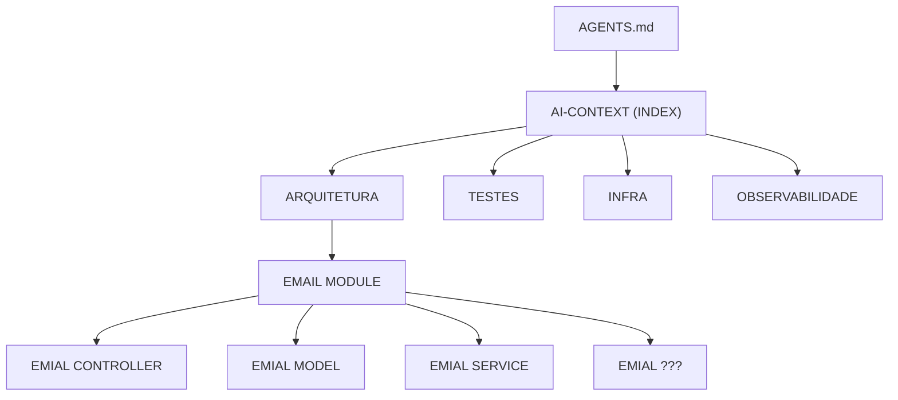

# CodeXperience: Escrevendo software de forma eficiente com IA

Abaixo trago um workflow simples para sair do zero a conseguir escrever softwares de forma eficiente 100% guiados à IA e sem `Vibe Coding`

## Contexto e case

Trabalhamos na empresa OLLO, que é uma empresa de marketing e está desenvolvendo uma solução própria de encurtador de link, hoje recebemos do time do produto a seguinte tarefa:

```markdown
# Demanda de Produto – Rota de Redirecionamento de Links

Queremos fechar o ciclo do nosso encurtador de links: hoje já é possível gerar um link curto, mas ainda não existe uma rota pública padrão para quando alguém clica nesse link.

Precisamos de uma rota única que receba o link encurtado e leve a pessoa automaticamente para a URL original, ou avise claramente quando o link não existir.

## O que esperamos ter ao final:

- Um endereço público no formato https://NOSSO_DOMINIO/r/{hash} que possa ser usado em campanhas, e-mails, etc.
- Se o hash existir, deve ser redirecionado para a URL original com o status de redirecionamento correto.
- Se o hash não existir, deve receber uma resposta de “não encontrado” (404).
```

Devemos desenvolver guiados à IA pois temos somente hoje para finalizar a sprint e entregar a demanda.
Esse projeto ainda não tem nada configurado para o uso de IA, então nosso workflow para iniciá-la e entregar essa tarefa 100% guiada à IA será:

# Workflow: Do zero a entrega com IA

## Escolher uma ferramenta

Somos livres para escolher a ferramenta que quisermos, iremos usar o Codex pois achamos o `gpt-5.1-codex` bem interessante para essa nossa tarefa e também é mais barato que o Claude Code

## Criando o entrypoint (`AGENTS.MD`)

Isso faz com que o code agent entenda o básico do seu projeto, sempre que for pedir algo para ele ele irá nesse arquivo e buscará as informações básicas dele

Geralmente os CLI code agents possuem um comando `/init` que gera um arquivo de localização da ferramenta (`CLAUDE.md, AGENTS.md, GEMINI.md, etc`),

Assim criamos o: [AGENTS.md](../AGENTS.md)

### Mas como manter esse arquivo atualizado caso o time use várias ferramentas?

Assim como fomos livres para escolher o `Codex` como ferramenta de trabalho, há outros devs em nossa equipe usando:

- Claude Code
- Gemini CLI
- Github copilot

E cada uma dessas ferramentas possui um arquivo diferente de configuração:

- CLAUDE.md
- GEMINI.md
- AGENTS.md

Pensando em sempre manter o mesmo contexto independente da ferramenta podemos criar um link simbólico entre eles

```bash
ln -s AGENTS.md CLAUDE.md
```

```bash
ln -s AGENTS.md GEMINI.md
```

## Expanda o contexto do seu projeto para a IA

Em alguns casos somente o [AGENTS.md](../AGENTS.md) já é suficiente, porém podemos expandir ainda mais o contexto para a IA não se perder e conseguir ser assertiva em conseguir obter o contexto da sua aplicação.
Para conseguir equilibrar tudo é interessante criar um banco de memória para ela, esse banco de memória serve tanto para a IA poder consultar e obter o contexto necessário quanto para humanos manterem o software bem documentado.

Não existe uma regra, mas vamos salvar todo o contexto na pasta: `ai-context`

Usei esse prompt ([EXPANDED_CONTEXT.md](./PROMPTS/EXPANDED_CONTEXT.md)) para gerar o contexto

Abaixo estão algumas dicas para ser mais efetivo nessa tarefa de expansão de contexto

### Separe em macro informações

Quebre a documentação entre os principais aspectos da aplicação, como:

```
- arquitetura
- boas práticas de escrita de código
- deploy (CI/CD)
- observabilidade
- testes
```

### Sempre tenha um índice principal

Com o índice o modelo irá diretamente onde precisa, por exemplo:

Se eu quiser entender sobre uma funcionalidade de envio de email da aplicação, posso pedir para a IA:

```bash
> Analise o projeto e explique como faço para poder enviar um email quando o usuário fechar um pedido.
```

O modelo vai buscar baseado no índice



Repare que ele não precisou colocar todo o resto no contexto, isso faz o modelo ser mais assertivo, rápido e principalmente `ECONOMIZAR TOKENS` 💰💰💰💰

Olhe a estrutura do [ai-context/index.md](../ai-context/index.md)

### Una seu [AGENTS.md](../AGENTS.md) com o contexto expandido

Linke o [`AGENTS.md`](../AGENTS.md) com o diretório `ai-context`

```markdown
# Repository Guidelines

> Sempre que precisar de visão geral, arquitetura ou regras específicas do projeto, consulte primeiro [`ai-context/index.md`](./ai-context/index.md). Ele centraliza navegação rápida para todos os resumos preparados para agentes e humanos.

## Project Structure & Module Organization

[...]
```

## O que precisamos de saber antes de nos aventurar a "codar" guiados à IA?

Já sabemos o que o time de produto quer e temos a IA configurada no nosso projeto, agora devemos desenvolver a tarefa de fato, mas precisamos entender alguns conceitos antes de pedir para o modelo desenvolver qualquer coisa.

#### Memória

Mas antes de tudo, precisamos entender alguns pontos: os modelos de LLM possuem memória de curto e longo prazo.

- Curto prazo: é o contexto imediato da conversa (janela de tokens atual), tudo que o modelo “vê” e usa para responder naquele turno.
- Longo prazo: é qualquer armazenamento externo ou ajuste permanente (banco de dados, RAG, fine-tuning, ou até um arquivo) usado para reintroduzir informações relevantes em conversas futuras.

Sabendo disso, entendemos que: se pedirmos para criar a tarefa e somente isso o modelo irá colocar isso na janela de contexto (curto prazo), mas se ele encher ela pode se perder durante o processo, gerando código que não queremos ou inventando regras de negócio.

**Precisamos garantir que ele use memória de longo prazo para não se perder durante tarefas futuras**

#### Plan mode VS Act mode

O modelo que estamos usando é o `gpt-5.1-codex`; ele é um modelo que possui reasoning por padrão, isso significa que o modelo consegue "raciocinar" antes de tomar alguma decisão.
Algumas ferramentas, como o `Claude Code`, possuem uma opção para o modelo pensar antes de executar; o `Codex` não possui isso por padrão.

**É extremamente eficiente e recomendado pedir para o modelo planejar a tarefa antes de executar**

#### Uso de TDD

TDD é visto como uma boa prática na programação; desenvolver guiado à IA com TDD tem vantagens, pois antes do modelo escrever qualquer linha de implementação, ele pensa nos casos de teste e os escreve, somente após isso ele implementa.

**Usando TDD os modelos nos dão uma certa garantia que eles pensaram antes em como deve ser implementado antes de implementar**

#### Nunca aceitar o que a IA está sugerindo sem validar

Somos engenheiros e não devemos aceitar cegamente o que uma ferramenta está sugerindo, mesmo com todo o contexto que iremos prover para o modelo ele irá errar em algo.

**Sempre veja e garanta que o código escrito pela IA é um código bom, se não for, intervenha e o faça do melhor jeito possível**

### Regras para executar uma tarefa guiada à IA

Como entendemos alguns conceitos e dicas, agora temos as regras:

- Precisamos garantir que ele use memória de longo prazo para não se perder durante tarefas futuras.
- É extremamente eficiente e recomendado pedir para o modelo planejar a tarefa antes de executar.
- Usando TDD os modelos nos dão uma certa garantia que eles pensaram antes em como deve ser implementado antes de implementar.
- Sempre veja e garanta que o código escrito pela IA é um código bom, se não for, intervenha e faça do melhor jeito possível.

Agora que temos as regras de ouro, vamos criar um modelo de plano de execução de tarefas.
O que isso significa: sempre que formos pedir para o modelo executar alguma tarefa ele deverá planejar antes usando o modelo que iremos desenvolver, assim garantimos que ela tenha uma **memória de longo prazo**, **planeje antes de executar**, **siga o TDD**, e ganhamos com isso checkpoints durante o desenvolvimento, ou seja, se o modelo **escreve um código ruim** podemos voltar à tarefa que desejamos e alterar o que for necessário.

Aqui temos o arquivo [PROMPTS/TEMPLATES/TEMPLATE_EXECUTION_PLAN.md](PROMPTS/TEMPLATES/TEMPLATE_EXECUTION_PLAN.md) que será nosso modelo.

## Vamos finalmente à tarefa...

Já sabemos o básico, agora vamos entregar a tarefa.
Nosso time de produto foi claro na tarefa **"criar uma rota para o usuário ser redirecionado"**

Ok, então vamos criar nosso prompt adicionando a ele todas as regras de negócio e indicando que ele deve _criar um plano de execução_... ele está aqui [PROMPTS/PROMPT_TASK.md](PROMPTS/PROMPT_TASK.md)

O executar o prompt foi criado o plano de execução dessa tarefa [CODEXPERIENCE/PLANS/REDIRECTOR_PLAN.md](CODEXPERIENCE/PLANS/REDIRECTOR_PLAN.md)

> Observe que esse plano já está atualizado, pois a tarefa já foi executada, como ele é a memória do modelo ele precisa atualizar ele ao fim de cada tarefa dando contexto do que foi feito

### Code review

Claro, não podemos esquecer do code review, uma boa prática é pedir para o próprio modelo fazer o code review.
As ferramentas como Codex e Claude Code já possuem isso nativamente, eles fazem em um outro contexto não tendo influência em tarefas passadas.

No Codex basta rodar o comando `/review` e ele o fará...

### Pull request

Perfeito, olhe o [PR](https://github.com/Rassis7/ollo-link-shortener/pull/32), o código está lá 👀

# Entrega efetuada!!

Pronto, saímos do zero até um workflow extremamente eficiente para o desenvolvimento guiado à IA.

Obrigado por me acompanhar nessa tarefa e até mais! ❤️
