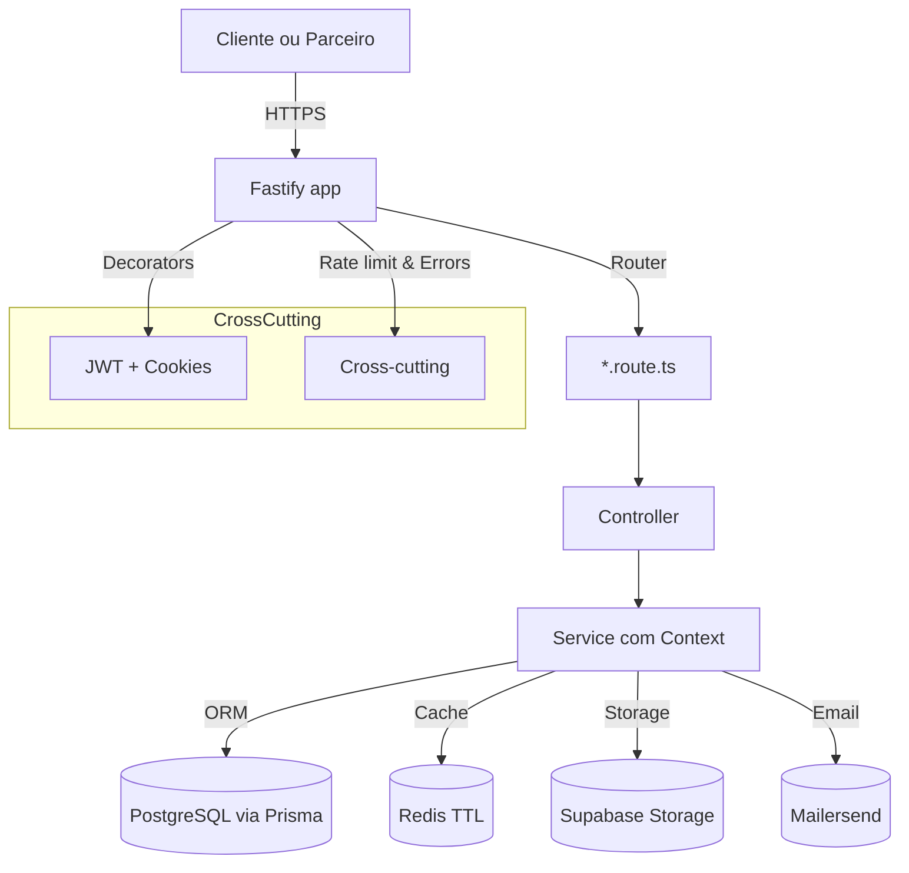

# Arquitetura

[Voltar ao índice](./index.md)

## Visão geral
- **Stack**: Fastify 4 + TypeScript estrito, Zod, Prisma, Redis e Supabase (`package.json`).
- **Entry-point**: `src/server.ts` carrega `.env.*`, registra CORS/multipart, aplica decorators Zod e monta rotas dos módulos (`auth`, `user`, `link`, `email`, `upload`, `health-check`).
- **Estilo**: módulos independentes agrupam `*.route.ts`, controllers, services e schemas; cross-cutting (logger, rate limit, JWT, doc) vive em `src/configurations/`.
- **Contexto**: services recebem `Context { prisma }` (`src/configurations/context.ts`) para preservar testabilidade e permitir trocar dependências.

## Componentes e responsabilidades
### Fastify server (`src/server.ts`)
- Registra `app.setValidatorCompiler`/`setSerializerCompiler` do `fastify-type-provider-zod` para typesafe IO.
- Configura CORS granular: libera `localhost` apenas em desenvolvimento e compara `INTERNAL_OLLO_LI_BASE_URL` em produção.
- Monta plugins opcionais (Swagger via `addApplicationDocumentation`) e controla `DEBUG_MODE` para logs mais verbosos.

### Configurações globais (`src/configurations/*`)
- `app.ts`: instancia Fastify + logger Pino (`logger` exportado para uso em serviços/scripts).
- `decorators.ts`: registra `@fastify/jwt`, cookies e decora `isAuthorized`, `verifyAccessToken` e `isAccountVerified` usados nas rotas protegidas.
- `errors.ts`: converte exceções (Fastify/Zod) em resposta estruturada com `ErrorHandler`, mantendo mensagens controladas.
- `rate-limit.ts`: aplica `@fastify/rate-limit` usando `FASTIFY_RATE_LIMIT_MAX`/`FASTIFY_RATE_LIMIT_TIME_WINDOW`.

### Infraestrutura (`src/infra`)
- `clients/prisma.ts`, `clients/redis.ts`, `clients/supabase.ts` centralizam SDKs e singletons (Redis reaproveita conexões e aplica prefixos em `CACHE_PREFIX`).
- `storages/cache.ts` oferece helpers `cache.get/set/expire/ttl` usados por links, emails e sinalização de contas.
- `storages/file-storage.ts` abstrai Supabase Storage com criação opcional de bucket e URLs públicas controladas via `SUPABASE_PUBLIC_URL`.

### Módulos de domínio (`src/modules/*`)
- Cada módulo possui `*.route.ts` que registra controladores dentro do Fastify, controllers que lidam com `FastifyRequest/FastifyReply`, schemas Zod com validação e tipagem, services com regra de negócio/persistência e testes (`__tests__`).
- Exemplo: `modules/link` expõe `shortenerLink`, caching (`saveOrUpdateLinkCache`) e `generateUrlHash`; `modules/email` orquestra MailerSend e TTL de códigos.
- Decoradores aplicados nas rotas (ex.: `app.isAuthorized`) garantem que serviços recebam `request.user` populado pelo middleware.

### Helpers e testes compartilhados
- `src/helpers` agrega hashing (bcrypt), TTL helpers, HTTP codes e `ErrorHandler` reaproveitado por controllers.
- `src/tests` oferece mocks globais (`prisma.ts`, `redis.ts`, `app.ts`, `jwt.ts`) consumidos pelos testes de cada módulo para evitar repetição.

## Fluxo end-to-end

- O fluxo acima representa uma chamada típica autenticada (ex.: criação de link). Controllers usam `ErrorHandler` para normalizar respostas HTTP (`src/helpers/error-handler.ts`).
- Serviços podem encadear Prisma + Redis (cache de links) ou Supabase (upload) antes de retornar ao controller.

## Convenções de integração
- **Alias `@/`**: configurado no `tsconfig.json` e reconhecido via `tsconfig-paths` e Jest (`moduleNameMapper`).
- **Contexto único**: controllers instanciam `context: { prisma }` importado de `@/infra` para facilitar testes com mocks.
- **Responsabilidade única**: regras de negócio ficam em `services`; controllers apenas orquestram dependências e formatam resposta.
- **Documentação cruzada**: decisões de domínio detalhadas em [Regras de Negócio](./regras-de-negocio.md); integrações operacionais em [Infraestrutura](./infraestrutura.md).
