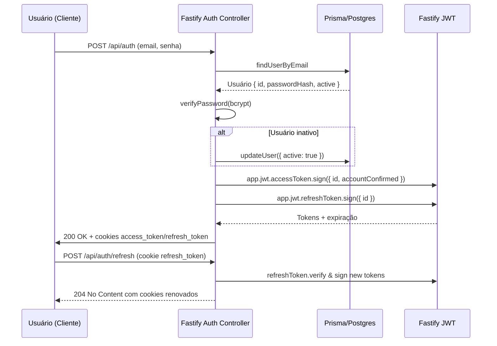

# Regras de Negócio

[Voltar ao índice](./index.md)

## Visão rápida
- As regras vivem majoritariamente nos `services` de cada módulo; controllers apenas validam input Zod e tratam respostas Fastify.
- O contexto (`Context { prisma }`) é obrigatório para toda operação que persiste dados, simplificando stubs em testes.
- Redis é usado como autoridade temporária para códigos, hashes de link e flags (conta não confirmada), evitando hits repetidos no Postgres.

## Casos por módulo
### Autenticação (`src/modules/auth`)
- `POST /api/auth`: busca usuário por email, reativa contas inativas (`updateUser`) e valida senha com `verifyPassword`. Gera dois JWTs (`access_token` e `refresh_token`) e envia em cookies; refresh expira em 7 dias.
- `POST /api/auth/refresh`: depende do decorator `verifyAccessToken`; gera novo par de tokens mantendo cookies HTTP-only exceto `access_token` (precisa ser lido pelo cliente Web).
- `POST /api/auth/logout`: limpa cookies e retorna `204`.
- Middleware `authorizationMiddleware` injeta `request.user` e bloqueia rotas privadas quando o token expira.

### Usuários (`src/modules/user`)
- `POST /api/users`: verifica unicidade de email, gera hash BCrypt (`helpers/hash.ts`), cria registro e dispara fluxo de verificação via módulo de email. Usuários começam com `accountConfirmed=false`.
- `PUT /api/users/:id` ou `GET /me`: exigem `isAuthorized`; atualização retorna apenas campos seguros (`id`, `name`, `email`, `active`, `accountConfirmed`).
- `POST /api/users/change-password`: requer token de recuperação válido em Redis (`CACHE_PREFIX.RECOVERY_PASSWORD`), gera novo hash e invalida o token.

### Emails (`src/modules/email`)
- `sendVerifyEmailHandler`: gera UUID, guarda em Redis (`emailVerification:<email>`) com TTL de 48h e envia template HTML com `verification_url` apontando para `INTERNAL_OLLO_LI_BASE_URL`.
- `verifyEmail`: valida TTL (`cache.ttl`), compara código e, se correto, confirma conta via `confirmUserAccount` e remove o cache.
- `sendRecoveryPasswordEmail`: cria link único válido por 15 minutos (`CACHE_PREFIX.RECOVERY_PASSWORD`) e envia template com instruções.
- Emails não são enviados em `NODE_ENV=development` (early return em `sendEmail`).

### Links (`src/modules/link`)
- `POST /api/links/shortener`: gera hash determinístico SHA-256 (8 caracteres) com entropia extra via `Math.random`; pode aceitar alias customizado desde que único.
- `saveOrUpdateLinkCache`: garante consistência cacheada; se hash já existir e `id` não foi informado (novo link), lança `LINK_ERRORS_RESPONSE.URL_HAS_EXISTS` antes de tocar no banco.
- `GET /api/links`: retorna paginação ordenada por `createdAt desc` apenas para o proprietário (`where: { userId }`).
- `PUT /api/links/:id`: atualiza metadados e sincroniza cache (com TTL opcional usando `validAt`).
- `GET /r/:hash`: módulo `redirector` aceita hash **ou** alias; tenta `cache.get(CACHE_PREFIX.LINK, valor)` primeiro, valida `active`/`validAt` e devolve `301 Location` apontando para `redirectTo`. Sem cache, consulta Prisma (`getLinkByHashOrAlias`), hidrata novamente o cache e responde `404` quando link está inativo/expirado.

### Uploads (`src/modules/upload`)
- `POST /api/upload`: exige usuário autenticado e verificado. O arquivo multipart é convertido em `File` (`convertMultipartToFile`), armazenado na Supabase e retorna URL pública montada via `SUPABASE_PUBLIC_URL`.
- Buckets dedicados podem ser criados dinamicamente informando `bucket` na chamada do serviço (`FileStorage.createBucket`).

### Health-check (`src/modules/health-check`)
- Simples `GET /healthcheck` retornando 200/204 para probes; útil em monitoramento e deploy.

## Sequência chave — Login com refresh automático

## Regras transversais
- **Account gating**: rotas críticas (links, uploads) combinam `app.isAuthorized` e `app.isAccountVerified` para impedir acesso até confirmação do email.
- **TTL consistente**: utilize `helpers/expire-cache-in-seconds.ts` para converter datas em segundos antes de chamar `cache.expire`, mantendo comportamento previsível entre links e emails.
- **Mensagens padronizadas**: enums como `AUTH_ERRORS_RESPONSE`, `LINK_ERRORS_RESPONSE`, `VERIFY_EMAIL_RESPONSE` concentram textos exibidos ao usuário.
- **Placeholders de URL**: sempre derive links públicos a partir de `INTERNAL_OLLO_LI_BASE_URL` ou `OLLO_LI_BASE_URL` para respeitar ambientes distintos.
- Para detalhes de execução técnica, complemente com [Arquitetura](./arquitetura.md) e para integrações externas consulte [Infraestrutura](./infraestrutura.md).
